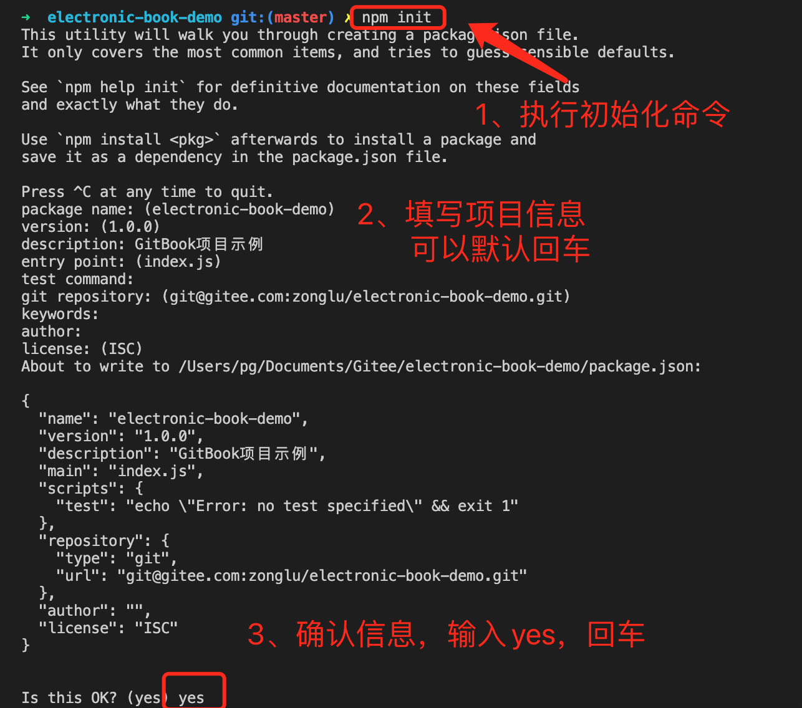

<h1 class="article-title no-number">环境准备</h1>

# 配置 Node.js 环境

使用 Gitbook 需要配置 Node.js 环境，具体的安装步骤，可查看[官方文档](https://nodejs.org/zh-cn/download/)。

> [!danger]
>
> 由于目前 Gitbook 项目已经停止维护，Node 过高可能出现不兼容问题。
>
> 目前，经笔者测试，Node 版本 **10.23.0** 以下版本可使用。

安装成功后，执行命令可查看 node 版本和 npm 版本。

```sh
# 查看node版本
node -v
# 查看npm版本
npm -v
```

# 安装 Gitbook

使用下面命令，安装 gitbook 包。

```sh
npm install -g gitbook-cli
```

# 初始化项目

## Gitbook 初始化

创建一个文件夹，并进入到该文件夹中，执行下面命令，初始化 gitbook 项目。

```sh
gitbook init
```

执行结果

```sh
info: create SUMMARY.md
info: initialization is finished
```

可以看到创建了 SUMMARY.md 文档，这是电子书的目录文档。

然后创建一个 REAMDE.md 文档，用来对这个项目进行介绍。

## npm 初始化

执行下面命令，初始化为 npm 项目。

```sh
npm init
```

命令会提示输入项目信息，可默认不填写，直接回车。

最后，会显示配置信息，输入`yes`回车即可初始化完毕。



初始化成功后，系统会自动在当前目录创建`package.json`文件，这是 npm 项目的配置文件。

## 章节配置

GitBook 使用文件 `SUMMARY.md` 来定义书本的章节和子章节的结构。文件 `SUMMARY.md` 被用来生成书本内容的预览表。

`SUMMARY.md` 的格式是一个简单的链接列表，链接的名字是章节的名字，链接的指向是章节文件的路径。

子章节被简单的定义为一个内嵌于父章节的列表。

```markdown
# 概要

- [章节一](chapter1.md)
- [章节二](chapter2.md)
- [章节三](chapter3.md)
```

```markdown
# 概要

- [第一章](part1/README.md)
  - [1.1 第一节](part1/writing.md)
  - [1.2 第二节](part1/gitbook.md)
- [第二章](part2/README.md)
  - [2.1 第一节](part2/feedback_please.md)
  - [2.2 第二节](part2/better_tools.md)
```

# 启动项目

在`package.json`文件的`scripts`中配置如下的脚本命令：

```json
"scripts": {
    "serve": "gitbook serve",
    "build": "gitbook build"
}
```

分别是 gitbook 在本地启动的命令，和 gitbook 打包成 HTML 静态文件的命令。

对于本地演示，我们可以直接通过下面命令启动。

```sh
npm run serve
```

这条命令其实就是执行了`package.json`文件的`scripts`中的`serve`脚本，即`gitbook serve`。

启动成功后，就可以在浏览器输入`http://localhost:4000/`，如图所示。


# 忽略文件

任何在文件夹下的文件，在最后生成电子书时都会被拷贝到输出目录中，如果想要忽略某些文件，和 Git 一样， Gitbook 会依次读取 `.gitignore`, `.bookignore` 和 `.ignore` 文件来将一些文件和目录排除。

# 配置文件

Gitbook 在编译书籍的时候会读取书籍源码顶层目录中的 `book.js` 或者 `book.json`，这里以 `book.json` 为例，参考 [gitbook 文档](https://github.com/GitbookIO/gitbook) 可以知道，`book.json` 常用的配置如下。

```json
{
    // 书籍信息
    "title": "书名",
    "description": "描述",
    "isbn": "图书编号",
  	"author": "作者",
  	"lang": "zh-cn",

    // 插件列表
    "plugins": [],

    // 插件全局配置
    "pluginsConfig": {
        "fontSettings": {
            "theme": "sepia", "night" or "white",
            "family": "serif" or "sans",
            "size": 1 to 4
        }
    },

  	// 模板变量
  	"variables": {
      	// 自定义
    }
}
```

当然，习惯用`book.js`的同学也可以，`book.js`只需要将 JSON 数据转为 JS 对象并导出即可，示例如下。

```js
module.exports = {
  // 书籍信息
  title: '书名',
  description: '描述',
  isbn: '图书编号',
  author: '作者',
  lang: 'zh-cn',

  // 插件列表
  plugins: [],

  // 插件全局配置
  pluginsConfig: {},

  // 模板变量
  variables: {
    // 自定义
  },
};
```

# 安装编辑器

Gitbook 编写可以用任何文本编辑器。在这里，我强烈安利 Typora 编辑器。Typora 编辑器是**非常非常非常**好用的 Markdown 文件编辑器，直接进[Typora 官网](https://www.typora.io/)下载对应平台的版本就可以了。当然，习惯用 Visual Studio 或者其他文本编辑工具的童鞋也可以根据自己的习惯自行选择。
