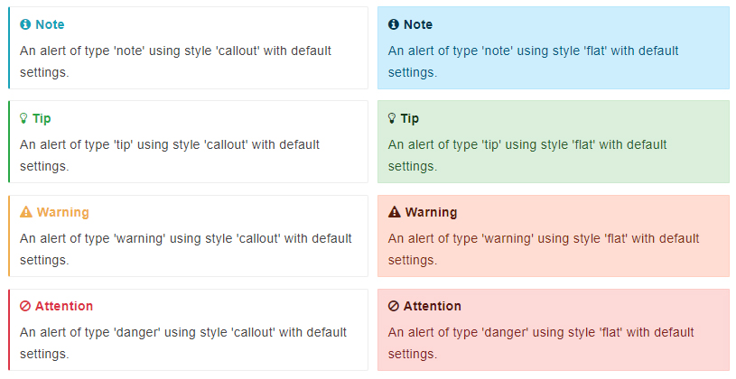
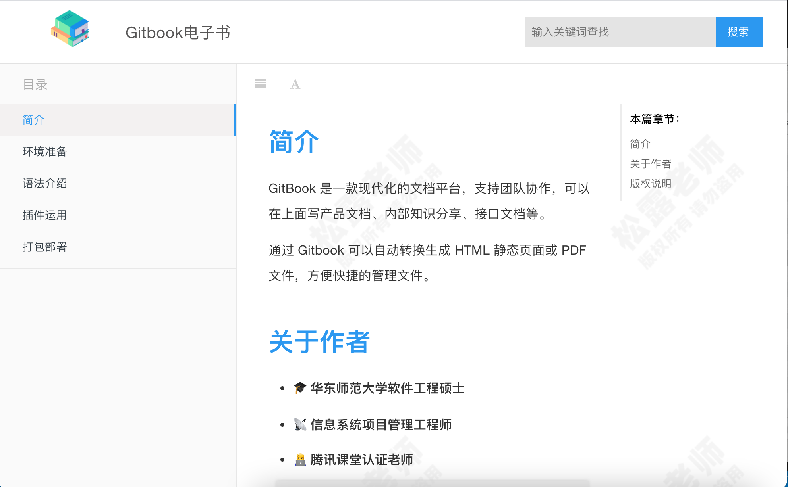

<h1 class="article-title no-number">插件运用</h1>

Gitbook 最灵活的地方就是有很多插件可以使用，当然如果对插件不满意，也可以自己写插件。所有插件的命名都是以`gitbook-plugin-xxx`的形式。下面，我们就介绍一些常用的插件。

使用插件前，现在当前项目的根目录中创建一个`book.js`文件，这是 Gitbook 的配置文件，文件内容可以根据自己来定制，内容格式如下。

```js
// book.js
module.exports = {
  title: 'Gitbook电子书',
  author: '松露老师',
  lang: 'zh-cn',
  description: 'Gitbook电子书示例项目',
};
```

> [!note]
>
> 想要了解每个插件的具体使用，可以去对应的插件官方文档中查看。

# 搜索插件

在命令行输入下面命令安装[搜索插件](https://www.npmjs.com/package/gitbook-plugin-search-pro)。

```sh
npm install gitbook-plugin-search-pro
```

安装成功后，在`book.js`中添加插件的配置。

```js
{
  plugins: ['search-pro'];
}
```

# 代码框插件

在命令行输入下面命令安装[代码插件](https://www.npmjs.com/package/gitbook-plugin-code)。

```sh
npm install gitbook-plugin-code
```

安装成功后，在`book.js`中添加插件的配置。

```js
{
  plugins: ['code'];
}
```

# 自定义主题插件

在命令行输入下面命令安装[自定义主题插件](https://www.npmjs.com/package/gitbook-plugin-theme-default)。

```sh
npm install gitbook-plugin-theme-主题名
```

安装成功后，在`book.js`中添加插件的配置。

```sh
{
    plugins: ["theme-主题名"]
}
```

> [!note]
>
> Gitbook 的主题插件都是以`gitbook-plugin-theme-xxx`形式命名的。

# 菜单折叠插件

在命令行输入下面命令安装[菜单栏折叠插件](https://www.npmjs.com/package/gitbook-plugin-expandable-chapters)。

```sh
npm install gitbook-plugin-expandable-chapters
```

安装成功后，在`book.js`中添加插件的配置。

```js
{
  plugins: ['expandable-chapters'];
}
```

# 返回顶部插件

在命令行输入下面命令安装[返回顶部插件](https://www.npmjs.com/package/gitbook-plugin-back-to-top-button)。

```sh
npm install gitbook-plugin-back-to-top-button
```

安装成功后，在`book.js`中添加插件的配置。

```js
{
  plugins: ['back-to-top-button'];
}
```

# 引用插件

在命令行输入下面命令安装[引用插件](https://www.npmjs.com/package/gitbook-plugin-flexible-alerts)。

```sh
npm install gitbook-plugin-flexible-alerts
```

安装成功后，在`book.js`中添加插件的配置。

```js
{
  plugins: ['flexible-alerts'];
  pluginsConfig: {
    "flexible-alerts": {
      style: "flat" // callout 或 flat
    }
  }
}
```

关于引用插件的使用，可以查看[官方文档](https://www.npmjs.com/package/gitbook-plugin-flexible-alerts)，最终的效果如下。



---

# 最终效果

下面我们来看看我的运行效果图，比刚开始美观多了。



> [!tip]
>
> 更多插件可以从 https://plugins.gitbook.com/ 获取。
