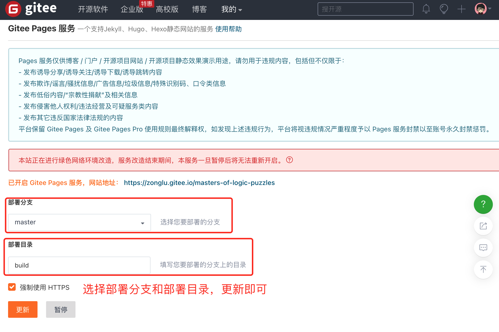
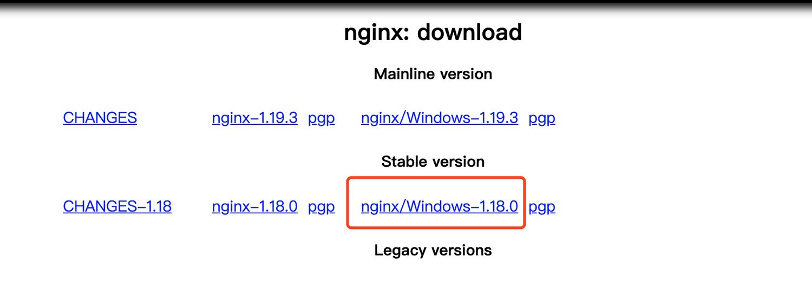
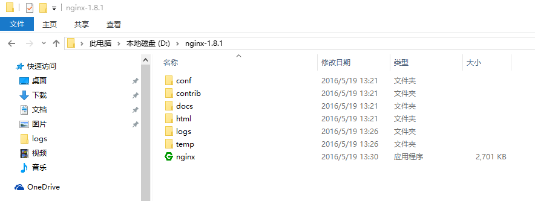

<h1 class="article-title no-number">服务部署</h1>

# 构建项目

使用`gitbook build`构建项目，成功后即可在`_book`文件夹中生成对应的静态资源。

# Pages 服务

很过 Git 服务提供商都有 Pages 服务，比如 Github Pages。由于 Github 的不稳定性，在国内访问经常出现问题，所以我们这边使用 Gitee Pages 服务。

将项目代码上传至 Gitee 的仓库，然后选择**服务-Gitee Pages**菜单。


进入菜单页后，**选择需要部署的分支和目录**，然后点击更新。更新成功后，即可通过 Gitee Pages 服务提供的地址访问。



# 安装 Nginx

对于想部署在自己服务器的同学，也可以通过 Nginx 做静态资源转发即可。Nginx 是轻量级 Web 服务器 ，它不仅是一个高性能的 HTTP 和反向代理服务器，同时也是一个 IMAP/POP3/SMTP 代理服务器。首先，在服务器上安装 Nginx 服务。不同服务器的安装方法也不同。

## macOS系统

```shell
# 安装
brew install nginx

# 启动
nginx

# 停止
nginx -s stop

# 重启
nginx -s reload

# 查看版本
nginx -v

# 测试
访问http://localhost:8080/
```

## Linux系统

```shell
# nginx 添加到 yum 源
sudo rpm -Uvh http://nginx.org/packages/centos/7/noarch/RPMS/nginx-release-centos-7-0.el7.ngx.noarch.rpm

# 安装
sudo yum install -y nginx

# 启动
sudo systemctl start nginx.service

# 设置开机自启动
sudo systemctl enable nginx.service
```

## Windows系统

1. 到 [Nginx 官网](http://nginx.org/en/download.html) 上下载相应的安装包。

   

2. 解压压缩文件，将解压后的文件放到合适的目录下，我的解压文件放在了 D 盘根目录下，如下图所示。

   Nginx 目录所在的路径中不要有中文字符，也不建议有空格。

   

3. 启动 Nginx。使用 CMD 命令 start 命令启动 nginx。

   ```shell
   # 进入Nginx的安装目录
   d: && cd nginx-1.8.1

   # start命令启动 nginx.exe 可执行文件
   start nginx
   ```

4. 测试。访问`http://localhost`，即可看到 Nginx 欢迎页。（_如果启动启动失败，可能是 IIS 占用了 80 端口。去掉 IIS 监听的 80 端口即可_。）

# 配置转发

Nginx 安装成功后，找到安装位置，Linux 服务器一般在`/etc/nginx/`目录下。

找到后，我们进入`/etc/nginx/conf.d/`文件夹，然后新建一个`demo.conf`文件，用来配置这个项目的 Nginx 配置，文件内容如下：

```js
server {
    listen       8065;
    server_name  你的服务器IP;

    location / {
        charset utf-8;
        root  /electronic-book-demo/build/;
        index  index.html index.htm;
    }
}
server {
    listen       80;
    server_name  demo.域名.com;

    location / {
        charset utf-8;
        root  /electronic-book-demo/build/;
        index  index.html index.htm;
    }
}
```

配置成功后，执行`nginx -s reload`，重启服务。

我们在浏览器即可通过配置的服务地址来查看了。


